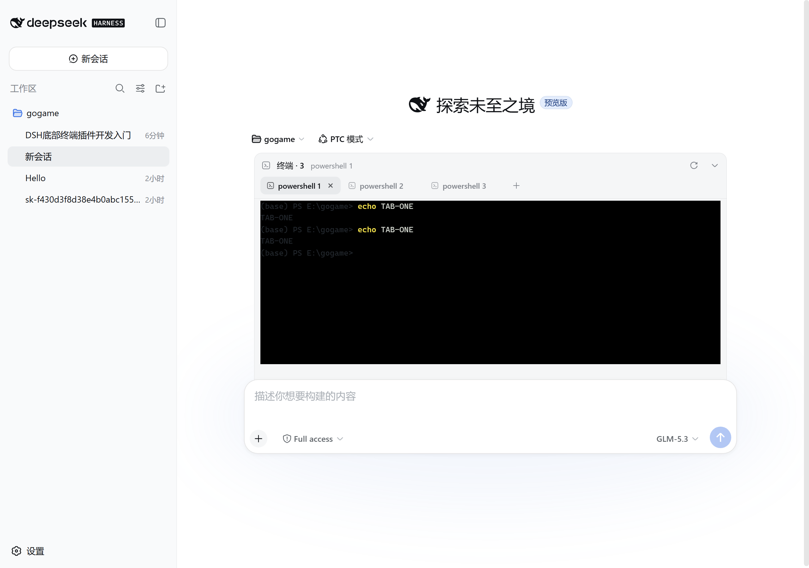

# dsh-plugin-terminal

Bottom terminal panel for the DeepSeek Harness (DSH) Web GUI — an interactive multi-tab shell pinned to the bottom of the page (ConPTY on Windows, openpty on Linux/macOS).

[中文](README.zh.md) · MIT

## Install

```sh
dsh plugin --profile web add dsh-plugin-terminal && dsh web
```

> Note: this is a DSH (DeepSeek Harness) plugin — do **not** use plain `npm i dsh-plugin-terminal`; it must be installed through `dsh plugin` to activate.

## Screenshots

| Collapsed | Expanded | Multi-tab |
|---|---|---|
|  |  |  |

## Features

- Bottom panel pinned to the viewport, aligned with the conversation column; the input box always stays above the terminal
- `Ctrl+`` toggles; drag the top grip to resize (120px–78% viewport, remembered)
- Multi-tab: `+` new, ✕ close, ⟳ restart; processes keep running on tab switch; live sessions restore after refresh
- xterm.js 6: colors, blinking cursor, alternate screen, Unicode, 5000-line scrollback
- WebSocket duplex channel to the PTY; dark terminal surface in both light and dark themes

## License

MIT
